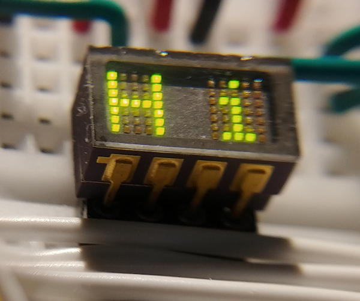
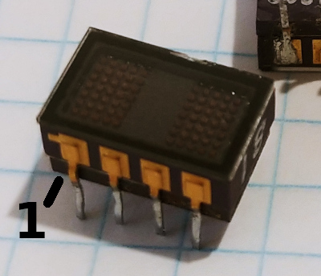
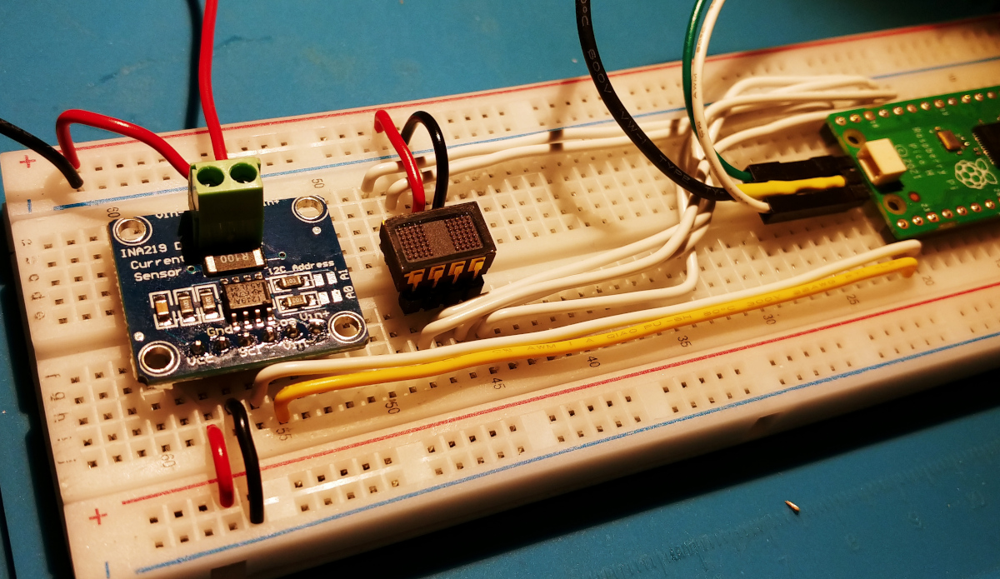
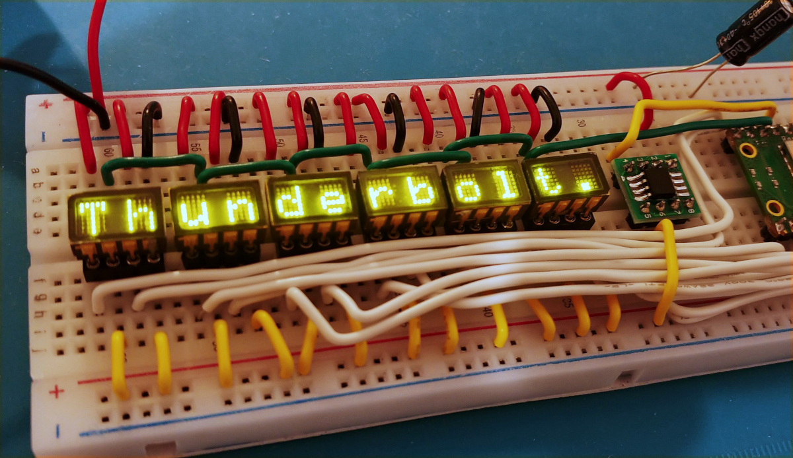

Plessey GPD340 - pinout & driving scheme
========================================

**GPD340** is a 2-character 5x7 dot-matrix LED smart display manufactured by Plessey in the 80s.

Since there is little to no information available on the internet about this display, this repo is the result of a successful attempt to reverse engineer the pinout and driving scheme in order to make these displays useful in hobby projects and such.




Pinout
------

| index | Name | Description |
| :---: | :--- | :--- |
|1|CHAR1_CLK| Serial clock input to load data into the first character|
|2|CHAR1_BR| LED brightness control for the first character|
|3|CHAR2_CLK| Serial clock input to load data into the second character|
|4|CHAR2_BR| LED brightness control for the second character|
|5|GND| Ground|
|6|VCC| Logic power supply|
|7|DATA| Serial data input to load pixel data into the characters|
|8|V_LED| LED power supply|

The pin indexing is conventional - it goes counterclockwise starting from the first pin designator:


Experimentally observed operating conditions
--------------------------------------------

| Pins | Conditions |
| :--- | :--- |
| VCC | Voltage: **4.2-5.2V**, Current consumption: **7-10mA**|
| CHARx_CLK, DATA | Logic high: **3.3-5.2V**, Logic low: **<1.2V**|
| V_LED | Voltage: **3.3-5.2**, Current consumption: **0-0.4A** depending on number of lit pixels and the CHARx_BR pins|
| CHARx_BR | Should be modulated at voltages **4.2-5.2V** to ensure uniform current flow through all ICs/characters|


Loading pixel data
------------------

Pixel data is loaded serially using the corresponding to either character CHARx_CLK and DATA pins. 

To start the serial transmission, the DATA and CLK pins must be pulled HIGH and exactly one clock cycle must be performed, that is, pull the CLK pin LOW and then after a short pause back to HIGH.
This is followed by the transmission of exactly 35 bits. Each '1' (the DATA pin pulled HIGH) in this data corresponds to a lit pixel and each '0' (the DATA pin pulled LOW) to an unlit pixel.
These 35 bits define 5x7 dot matrix, the top row of which (the first 5 bits) goes to the bottom-most pixels of the character.
For example, to display the letter 'V' the following bits must be loaded:
```
const uint8_t char_v[] =
{
    0b00100,
    0b01010,
    0b01010,
    0b10001,
    0b10001,
    0b10001,
    0b10001,
};
```

Once all 35 bits of data are loaded, the corresponding LEDs light up.

Current limiting/dimming the LEDs
---------------------------------
The LED current for each character is controlled by the respective CHARx_BR pin.
Generally, these two pins should be PWMed all the time to avoid overcurrenting the LEDs.
A PWM at 5V with duty cycle of ~30% appears to provide full brightness.


Reverse engineering process and test setups
===========================================

Initial study
-------------
Every pin pair combination was carefully probed with a current limited power supply and a precision ammeter to determine which pins are VCC and GND.
As it turns out, only one combination of pins draws significant current of 7-8mA and no more than that. These pins were 5(GND) and 6(VCC).

Given the low count of pins(just 8), it was assumed that the display has to utilize some serial protocol to load pixel data into internal registers.
Thus, it should have at least one serial clock input and at least one serial data input and the other pins could be chip-selects, output-enables, etc.


Bruteforcing setup
------------------
After some unsuccessful attempts to manually determine the controlling pins and serial protocol, it was decided to build a breadboard contraption that would automatically
go through all combinations of the remaining 6 pins, sequentially assign them the roles of serial clock, serial data and "fixed pins". And attempt to load
some data patterns according to the assigned roles and monitor and log the current while doing all this.

The contraption was built based on a Raspberry Pi pico and an INA219 current sensor module.
While going through the combinations, the current monitoring data from INA219 is written to UART0 which is read from minicom on the connected PC,
the log from minicom is stored in a file for further analysis.


The setup was run at 4.2 volts and with a limited supply current to avoid potential overcurrent of the subjected GPD340 and/or damage of the pico's GPIOs.
After a few minutes of running, some random pixels on the GPD340 begin to glow dimly, which was a good sign.
Then, after a full run and analysis of the collected current monitor log - it was clearly visible which combination of pins caused the current to surge.
After that, it was very easy to see which pin is which.

Further figuring out the serial protocol was done by manual experimenting on the same breadboard.

And finally, another breadboard was built that features six GPD340s hooked up together displaying scrolling text.



Sources for both the bruteforcer and six display demo could be found in the src directory. The breadboard schematics could be found in breadboards.pdf.

# Building Raspberry Pi pico bruteforcer/demo firmware

### Prerequisites 

Generally, refer to the official [Getting started guide](https://datasheets.raspberrypi.com/pico/getting-started-with-pico.pdf)

You'll need to have:

- ARM embedded gcc toolchain
- GDB (gdb-multiarch)
- Pico SDK
- Pico probe
- Pico OpenOCD

The following environment constant should be defined:
```
PICO_SDK_PATH=/* Path to the root of pico-sdk directory */
```

### Configuring and building

```
cd src
mkdir build
cd build
cmake -DCMAKE_BUILD_TYPE=Debug ..

make
```

### Running and debugging

Connect the picoprobe to the target pico/pico_w board according to the "getting started guide", then run the following:

```
cd [Pico OpenOCD source directory]
sudo src/openocd -f interface/picoprobe.cfg -f target/rp2040.cfg -s tcl
```
It should start a GDB server on the default port 3333.

To flash and run/debug the firmware navigate to the project's directory and run the following: 
```
cd build

# to run the demo
gdb-multiarch ./demo.elf

# to run the bruteforcer
gdb-multiarch ./bruteforcer.elf
```
Once GDB started:
```
target remote :3333
load
monitor init reset
cont
```
